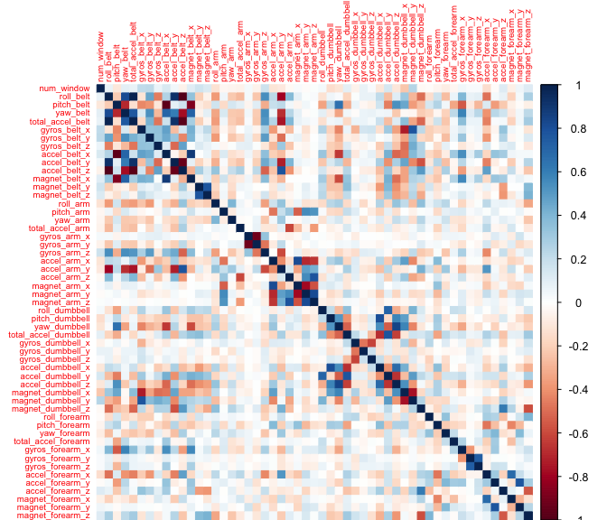

 

### Synopsis

Using devices such as Jawbone Up, Nike FuelBand, and Fitbit it is now
possible to collect a large amount of data about personal activity
relatively inexpensively. These type of devices are part of the
quantified self movement - a group of enthusiasts who take measurements
about themselves regularly to improve their health, to find patterns in
their behavior, or because they are tech geeks. In this report, **I aim
to predict the manner of exercise** that were taken by individuals in 20
test cases **based on various measured physical parameters**. To do so,
I conduct exploratory analysis on a training data set, select the most
appropriate variables and create a prediction model of highest accuracy
obtained while working on the testing dataset.

&lt;--! You should create a report describing how you built your model,
how you used cross validation, what you think the expected out of sample
error is, and why you made the choices you did. You will also use your
prediction model to predict 20 different test cases. --&gt;  
 

### The dataset

This human activity recognition data set is obtained from an experiment
conducted on 6 participants. The data were retrieved from accelerometers
on the belt, forearm, arm, and dumbell of these participants who were
asked to perform barbell lifts correctly and incorrectly in 5 different
ways. More information is available from the website
[here](http://web.archive.org/web/20161224072740/http:/groupware.les.inf.puc-rio.br/har).
(See the section on the Weight Lifting Exercise Dataset).  
  The training and test data were retrieved respectively from
[here](https://d396qusza40orc.cloudfront.net/predmachlearn/pml-training.csv)
and
[here](https://d396qusza40orc.cloudfront.net/predmachlearn/pml-testing.csv).  
  *Reference: Velloso, E.; Bulling, A.; Gellersen, H.; Ugulino, W.;
Fuks, H. "Qualitative Activity Recognition of Weight Lifting Exercises.
Proceedings of 4th International Conference in Cooperation with SIGCHI
(Augmented Human '13)". Stuttgart, Germany: ACM SIGCHI, 2013.*  
 

### Downloading and cleaning data

    library(caret)

    ## Loading required package: lattice

    ## Loading required package: ggplot2

    # 1.Downloading the data
    UrlTrain <- "http://d396qusza40orc.cloudfront.net/predmachlearn/pml-training.csv"
    UrlTest  <- "http://d396qusza40orc.cloudfront.net/predmachlearn/pml-testing.csv"
    training <- read.csv(url(UrlTrain))
    testing  <- read.csv(url(UrlTest))

    # 2.Removing non-predictor variables (column 1-5)
    training <- training[,-(1:5)]
    testing <- testing[,-(1:5)]

    # 3.Removing variables with near zero variances
    NZV <- nearZeroVar(training)
    training <- training[,-NZV]
    testing <- testing[,-NZV]

    # 4.Removing variables with more than 95% NA values
    isNA <- which((apply(is.na(testing), 2, mean) > 0.95) == TRUE)
    training <- training[,-isNA]
    testing <- testing[,-isNA]

    dim(training); dim(testing)

    ## [1] 19622    54

    ## [1] 20 54

The resulting datasets each contains 54 variables which was reduced from
an initial list of 160.

### Spliting the data

I first partitioned the training dataset further into two in the ratio
70:30 to create a myTrain set for model building and a myTest set for
validating the model. The previously downloaded testing dataset is
unchanged and will only be used to generate results to the quiz.

    inTrain  <- createDataPartition(training$classe, p=0.7, list=FALSE)
    myTrain <- training[inTrain, ]
    myTest  <- training[-inTrain, ]
    dim(myTrain); dim(myTest)

    ## [1] 13737    54

    ## [1] 5885   54

### Exploring the data

I was first curious to know about the correlation between the 53
predictors in order to ascertain if a principle component analysis is
required to summarize them.

    library(corrplot)
    corrplot(cor(myTrain[, -54]), method = "color", tl.cex = 0.6)

    M <- abs(cor(myTrain[, -54]))
    diag(M) <- 0
    sum (M>0.8, arr.ind = TRUE) / (53^2 -53)

    ## [1] 0.01124819

It appears that only 1% of predictors are highly correlated to each
other. This suggests that preprocessing through pca may not be
necessary.

### Building the prediction model

    library(randomForest)

    ## randomForest 4.6-12

    ## Type rfNews() to see new features/changes/bug fixes.

    ## 
    ## Attaching package: 'randomForest'

    ## The following object is masked from 'package:ggplot2':
    ## 
    ##     margin

    set.seed(33833)
    controlRF <- trainControl(method="cv", number=3)
    ModFitRF <- train(classe ~ ., data=myTrain, method="rf", trControl=controlRF)
    ModFitRF$finalModel

    ## 
    ## Call:
    ##  randomForest(x = x, y = y, mtry = param$mtry) 
    ##                Type of random forest: classification
    ##                      Number of trees: 500
    ## No. of variables tried at each split: 27
    ## 
    ##         OOB estimate of  error rate: 0.28%
    ## Confusion matrix:
    ##      A    B    C    D    E class.error
    ## A 3906    0    0    0    0 0.000000000
    ## B    9 2645    4    0    0 0.004890895
    ## C    0    4 2391    1    0 0.002086811
    ## D    0    0   11 2240    1 0.005328597
    ## E    0    1    0    7 2517 0.003168317

    predictRF <- predict(ModFitRF, newdata=myTest)
    confusionMatrix(predictRF, myTest$classe)

    ## Confusion Matrix and Statistics
    ## 
    ##           Reference
    ## Prediction    A    B    C    D    E
    ##          A 1673    2    0    0    0
    ##          B    0 1136    2    0    0
    ##          C    0    1 1024    3    0
    ##          D    0    0    0  961    6
    ##          E    1    0    0    0 1076
    ## 
    ## Overall Statistics
    ##                                           
    ##                Accuracy : 0.9975          
    ##                  95% CI : (0.9958, 0.9986)
    ##     No Information Rate : 0.2845          
    ##     P-Value [Acc > NIR] : < 2.2e-16       
    ##                                           
    ##                   Kappa : 0.9968          
    ##  Mcnemar's Test P-Value : NA              
    ## 
    ## Statistics by Class:
    ## 
    ##                      Class: A Class: B Class: C Class: D Class: E
    ## Sensitivity            0.9994   0.9974   0.9981   0.9969   0.9945
    ## Specificity            0.9995   0.9996   0.9992   0.9988   0.9998
    ## Pos Pred Value         0.9988   0.9982   0.9961   0.9938   0.9991
    ## Neg Pred Value         0.9998   0.9994   0.9996   0.9994   0.9988
    ## Prevalence             0.2845   0.1935   0.1743   0.1638   0.1839
    ## Detection Rate         0.2843   0.1930   0.1740   0.1633   0.1828
    ## Detection Prevalence   0.2846   0.1934   0.1747   0.1643   0.1830
    ## Balanced Accuracy      0.9995   0.9985   0.9986   0.9978   0.9971

This model yields a pretty high accuracy of 99.8% with an error rate of
0.26%.

### Applying model to testing dataset

The Random Forest model was applied to predict the 20 quiz results from
the testing dataset as shown below.

    predict(ModFitRF, newdata=testing)

    ##  [1] B A B A A E D B A A B C B A E E A B B B
    ## Levels: A B C D E
